### Hello there!
I am a problem solver.
Currently working as a data engineer.

### 🚀 Visit My Website & portfolio
## [Asangika Kuruppu](https://asangikak.github.io/)

### 🛠️ Tech Stack

| Languages                                 | Storage & Warehouses                            | Orchestration & Workflow                               | Data Processing & Streaming                   | DevOps                                        |
|:------------------------------------------|-------------------------------------------------|--------------------------------------------------------|:----------------------------------------------|:----------------------------------------------|
| 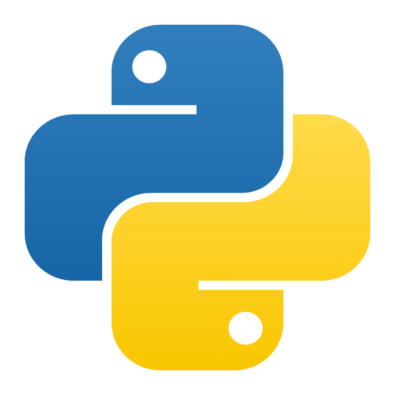   | 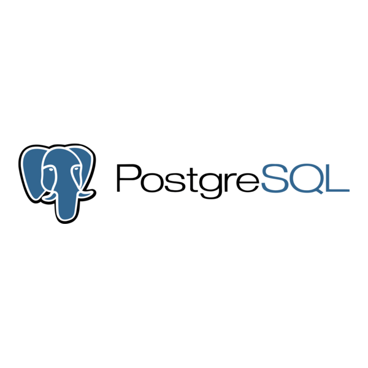 |  | 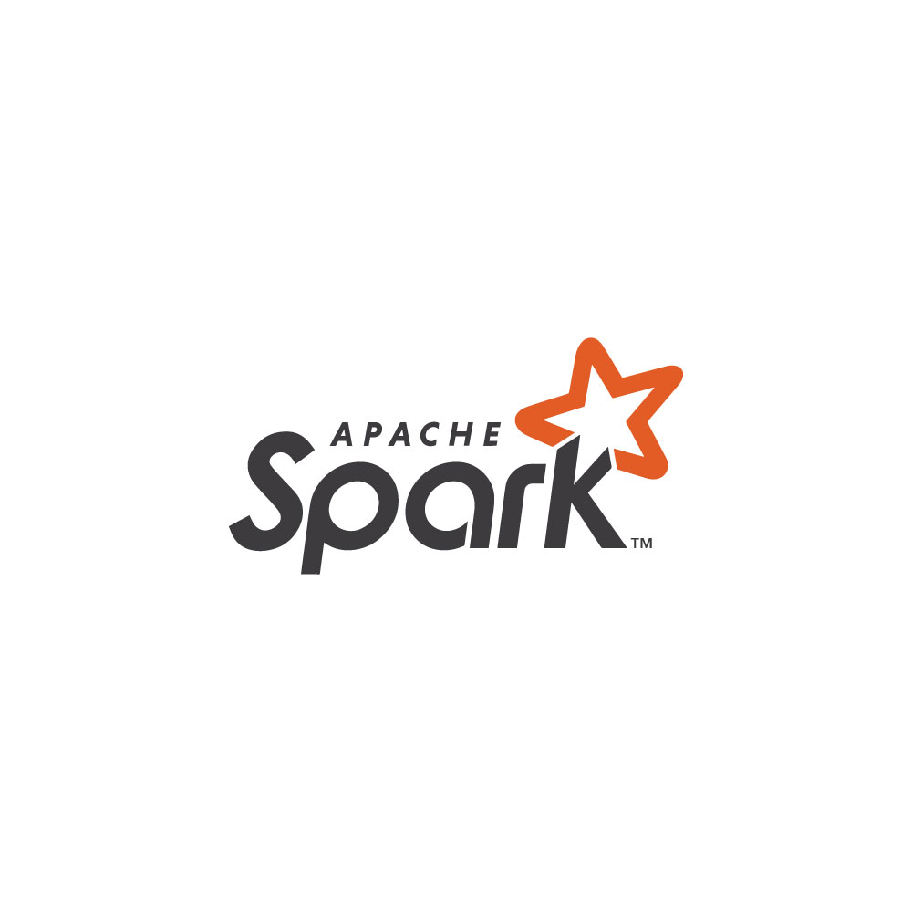         | 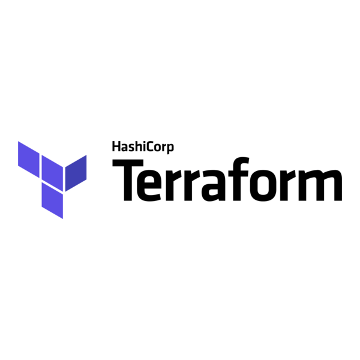 |
| 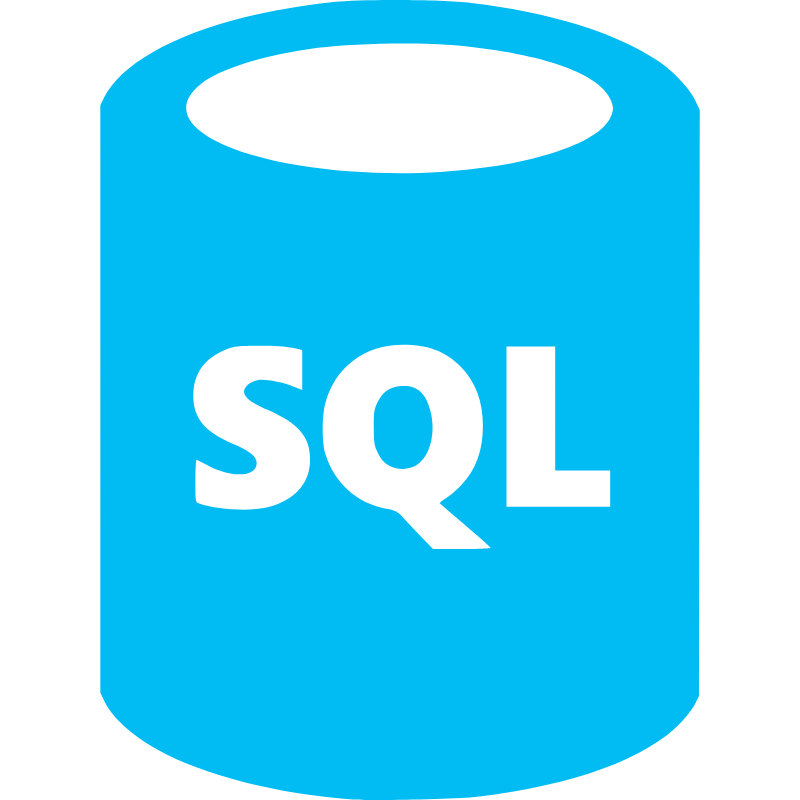         | 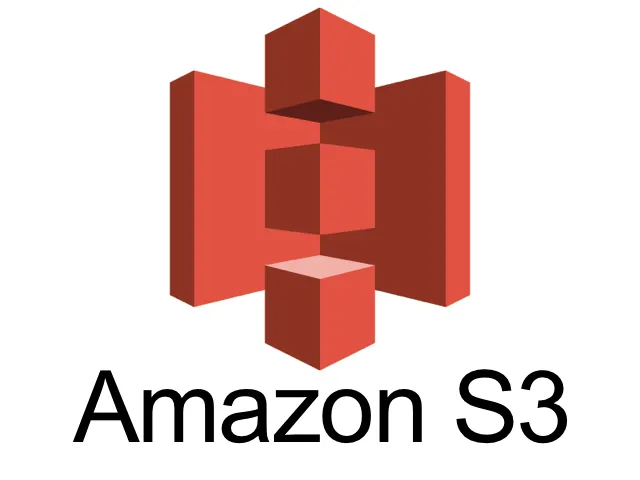       | 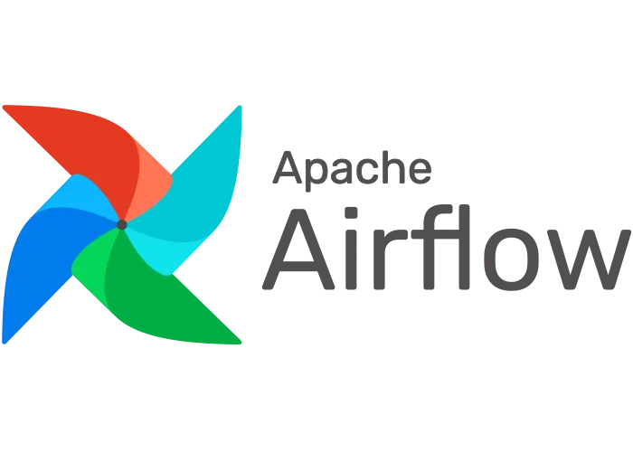              |        | 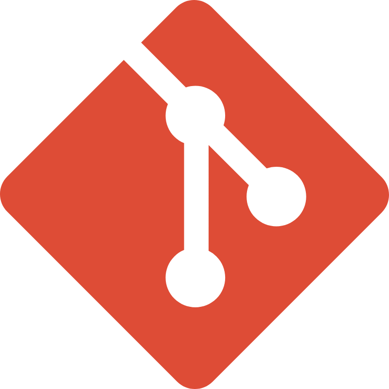       |
| 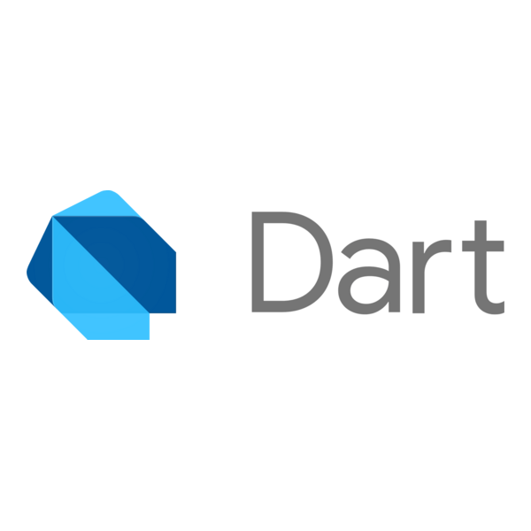       | 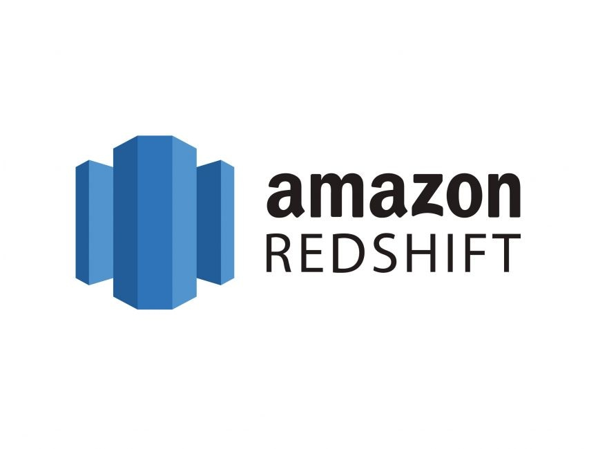     |                    |  | 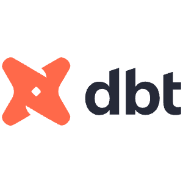             |
